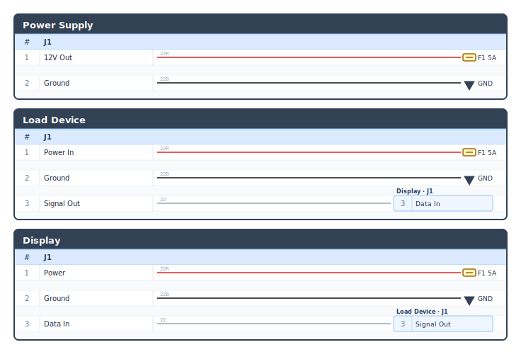

# loome

A Python tool for describing and visualizing aircraft wiring harnesses. Write a spec file in plain Python, then render schematic SVGs, bundle layout diagrams, bills of materials, and fuse schedules from it.

## Installation

```
pip install loome
```

## Quick start

```python
# my_harness.py
from loome import Component, Connector, Fuse, GroundSymbol, Harness, Pin, SpliceNode

class PowerSupply(Component):
    class J1(Connector):
        positive = Pin(1, "12V Out")
        ground   = Pin(2, "Ground")

class LoadDevice(Component):
    class J1(Connector):
        power  = Pin(1, "Power In")
        ground = Pin(2, "Ground")
        signal = Pin(3, "Signal Out")

class Display(Component):
    class J1(Connector):
        power   = Pin(1, "Power")
        ground  = Pin(2, "Ground")
        data_in = Pin(3, "Data In")

psu     = PowerSupply("Power Supply")
device  = LoadDevice("Load Device")
display = Display("Display")

f1  = Fuse("F1", amps=5)
sp1 = SpliceNode("SP1", label="Power Splice")
gnd = GroundSymbol("GND")

psu.J1.positive >> f1
sp1 >> device.J1.power
sp1 >> display.J1.power
psu.J1.ground  >> gnd
device.J1.ground >> gnd
display.J1.ground >> gnd
device.J1.signal >> display.J1.data_in

harness = Harness("My Harness", length_unit="in")
```

```
loome render my_harness.py -o my_harness.svg
```

Rendered output (`examples/minimal.svg`):



---

## CLI reference

Every subcommand takes a spec file as its first positional argument. The spec must assign a `Harness` instance to a module-level variable named `harness`.

### `loome render <spec>`

Renders a schematic SVG showing all components, connectors, pins, and wire connections.

| Flag | Default | Description |
|------|---------|-------------|
| `-o / --output` | `out.svg` | Output SVG path |
| `--no-color` | off | Render wires in monochrome |
| `--show-unconnected` | off | Include unconnected pins |

### `loome bundle <spec>`

Renders the physical bundle topology as SVG — the tree of breakout nodes, trunk lengths, and connector stubs.

| Flag | Default | Description |
|------|---------|-------------|
| `-o / --output` | `bundle.svg` | Output SVG path (stem is reused per bundle) |
| `--name` | all | Render only the named bundle |

### `loome bom <spec>`

Emits a bill of materials: wires (by gauge and color), connectors, and terminals.

| Flag | Default | Description |
|------|---------|-------------|
| `-o / --output` | stdout | Output file |
| `--format` | `md` | `md` or `csv` |

### `loome fuses <spec>`

Emits a fuse/circuit-breaker schedule listing what each protective device feeds.

| Flag | Default | Description |
|------|---------|-------------|
| `-o / --output` | stdout | Output file |
| `--format` | `md` | `md` or `csv` |

---

## Defining components

A component is a Python class that subclasses `Component`. Connectors are inner classes subclassing `Connector`, and pins are class attributes created with `Pin(number, signal_name)`.

```python
from loome import Component, Connector, Pin

class MyECU(Component):
    class J1(Connector):
        power  = Pin(1, "Power In")
        ground = Pin(2, "Ground")

    class J2(Connector):
        rs232_tx = Pin(3, "RS-232 TX")
        rs232_rx = Pin(4, "RS-232 RX")
```

Pin numbers can be integers or strings (useful for wire-color-coded devices like OAT probes):

```python
class OATProbe(Component):
    power = Pin("WHT", "OAT Probe Power")
    sense = Pin("BLU", "OAT Probe Sense")
    low   = Pin("ORN", "OAT Probe Low")
```

Components are instantiated with a display label:

```python
ecu   = MyECU("Engine ECU")
probe = OATProbe("OAT Probe")
```

### Composite port types

Pre-built port descriptors handle common multi-wire interfaces and auto-wire shared bus lines:

```python
from loome import Component, Connector, Pin, CanBus, RS232, GPIO

class Sensor(Component):
    class J1(Connector):
        can    = CanBus(1, 2)                        # CAN High pin 1, Low pin 2
        serial = RS232(5, 4, 6, name="RS-232 1")     # TX, RX, GND
        pos    = GPIO(7, 8, 9, name="Position")      # +, signal, GND (shielded)
```

`RS232` instances cross-wire automatically: `device_a.J1.serial.connect(device_b.J1.serial)`.

### Switches (built-in)

```python
from loome import SPST, SPDT, DPST, DPDT

sw = SPST("Master Switch")           # pins: com, no
sw = SPDT("Fuel Selector")           # pins: com, no, nc
sw = DPST("Dual Master", momentary=True)  # pins: com1, no1, com2, no2
sw = DPDT("Crossfeed")               # pins: com1, no1, nc1, com2, no2, nc2
```

### Configuration-dependent wiring

Override `__init__` to apply wiring that depends on instantiation arguments:

```python
from loome.constants import Axis

class Servo(Component):
    def __init__(self, name: str, axis: Axis | None = None):
        super().__init__(name)
        if axis == Axis.PITCH:
            self.J1[5].connect(self.J1[8])   # strap ID pins

    class J1(Connector):
        id_strap_1 = Pin(5, "ID Strap 1")
        id_strap_4 = Pin(8, "ID Strap 4")

pitch_servo = Servo("Pitch Servo", axis=Axis.PITCH)
```

---

## Defining a harness

A harness spec is a plain `.py` file. The CLI `exec()`s it and looks for a module-level variable named `harness`.

### Wiring

Wires connect pins and terminals using `>>` (operator) or `.connect()` (method):

```python
# Operator style — returns a WireBuilder for optional chaining
pin_a >> pin_b
(pin_a >> pin_b).gauge(20).color("R").wire_id("W1").notes("check polarity")

# Method style — returns a WireSegment directly
pin_a.connect(pin_b, wire_id="W1", gauge=22, color="R")
```

Wire colors: `"R"` red, `"W"` white, `"B"` / `"N"` black, `"BL"` blue, `"OR"` orange, `"Y"` yellow, `"GN"` green, `"GR"` gray, `"PK"` pink, `"VT"` violet, `""` auto.

Default gauge is 22 AWG.

### Terminals

Terminals are the endpoints for wires that don't go to another connector pin.

```python
from loome import GroundSymbol, OffPageReference, Fuse, CircuitBreaker, BusBar

gnd     = GroundSymbol("GND")                  # chassis ground (filled triangle)
local   = GroundSymbol("local", filled=False)  # signal/local ground (open triangle)
ext_ref = OffPageReference("EXT1", label="To Avionics Bus")  # off-page chevron
fuse    = Fuse("F1", amps=5)
cb      = CircuitBreaker("CB1", amps=10)
bus     = BusBar("BATT_BUS", label="Battery Bus")
```

Terminals are wire **endpoints** — connect to them from a pin or splice node:

```python
pin >> gnd
pin >> fuse
splice >> pin
```

### Splice nodes

A splice node fans one wire out to many destinations:

```python
from loome import SpliceNode

sp = SpliceNode("SP1", label="Power Splice")
source_pin >> fuse
sp >> load_a.J1.power
sp >> load_b.J1.power
sp >> load_c.J1.power
```

### Fuse blocks

```python
from loome import Fuse, FuseBlock

# Declarative subclass (preferred for named blocks)
class AvionicsBlock(FuseBlock):
    PFD   = Fuse("PFD",   amps=5)
    MFD   = Fuse("MFD",   amps=5)
    COMM1 = Fuse("COMM1", amps=7.5)

fb = AvionicsBlock()
bus >> fb.PFD   # connect bus to each fuse
```

### Shields

```python
from loome import Shield

with Shield(drain=gnd, drain_remote=local) as oat_shield:
    sensor.J1.high.connect(ecu.J2.sense_high)
    sensor.J1.low.connect(ecu.J2.sense_low)
```

All connections inside the `with` block share one shield foil.

### CAN bus lines

```python
from loome import CanBusLine

CanBusLine(
    name="CAN Bus",
    devices=[device_a.J1, device_b.J1, device_c.J1],  # ordered along bus
)
```

### Physical bundle topology

Bundles let loome compute wire lengths from a topology tree of breakout points:

```python
from loome import Bundle

main      = Bundle("Main Run")
firewall  = main.breakout("firewall")
mid_cabin = main.breakout("mid-cabin", after=firewall, length=36)  # 36 in trunk
tail      = main.breakout("tail",      after=mid_cabin, length=24)

firewall.attach(ecu.J1,    leg_length=4)   # 4 in stub from trunk to connector
firewall.attach(gnd,       leg_length=2)
mid_cabin.attach(device.J1, leg_length=6)
tail.attach(sensor.J1,    leg_length=3)
```

### Harness object

```python
harness = Harness("My Harness", length_unit="in")
```

`Harness` auto-detects all components, splices, terminals, shields, bundles, and CAN bus lines defined in the spec's module namespace — no need to register them manually.

---

## Built-in component library

Loome ships Garmin avionics definitions under `loome.components`:

```python
from loome.components.garmin import (
    GAD27, GAD29C, GDU460, GEA24, GMC507, GMU11,
    GSA28, GSU25, GTR20, GTX45R, GDL51R, GMA245, GTP59, G5, GAP2620,
)
from loome.components.gtn650 import GTN650Xi
from loome.components import RayAllanTrim, Stick, LEMO, TRS
```

---

## Imports reference

Everything needed for a spec file is importable from the top-level `loome` package:

```python
from loome import (
    # Core
    Component, Connector, Pin, WireColor,
    # Terminals
    GroundSymbol, OffPageReference, Fuse, FuseBlock,
    CircuitBreaker, CircuitBreakerBank, BusBar, SpliceNode, Terminal,
    # Composite ports
    CanBus, RS232, GPIO,
    # Shields
    Shield, ShieldGroup,
    # Topology
    Bundle, Breakout, CanBusLine,
    # Harness
    Harness,
    # Switches
    SPST, SPDT, DPST, DPDT,
)
```
